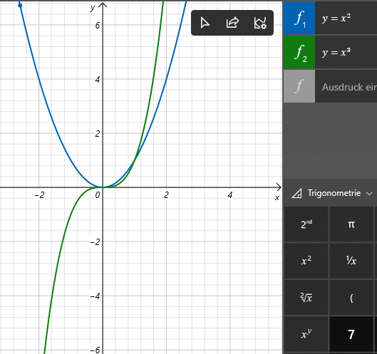
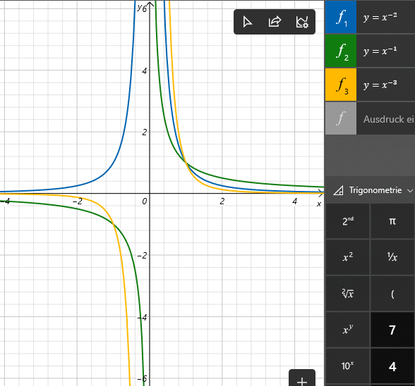
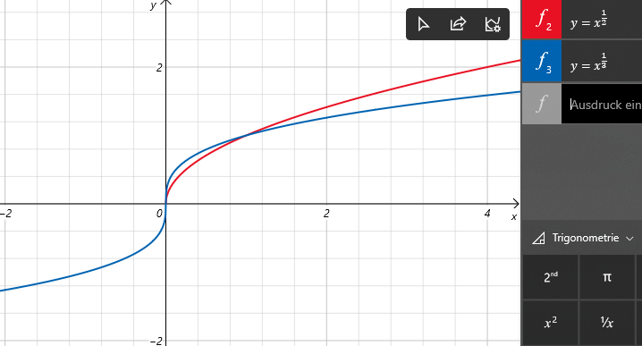
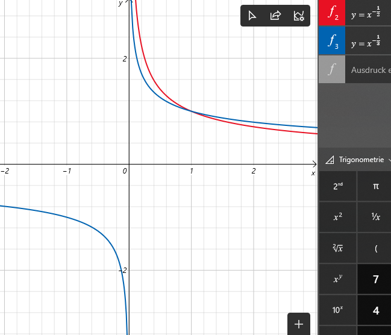
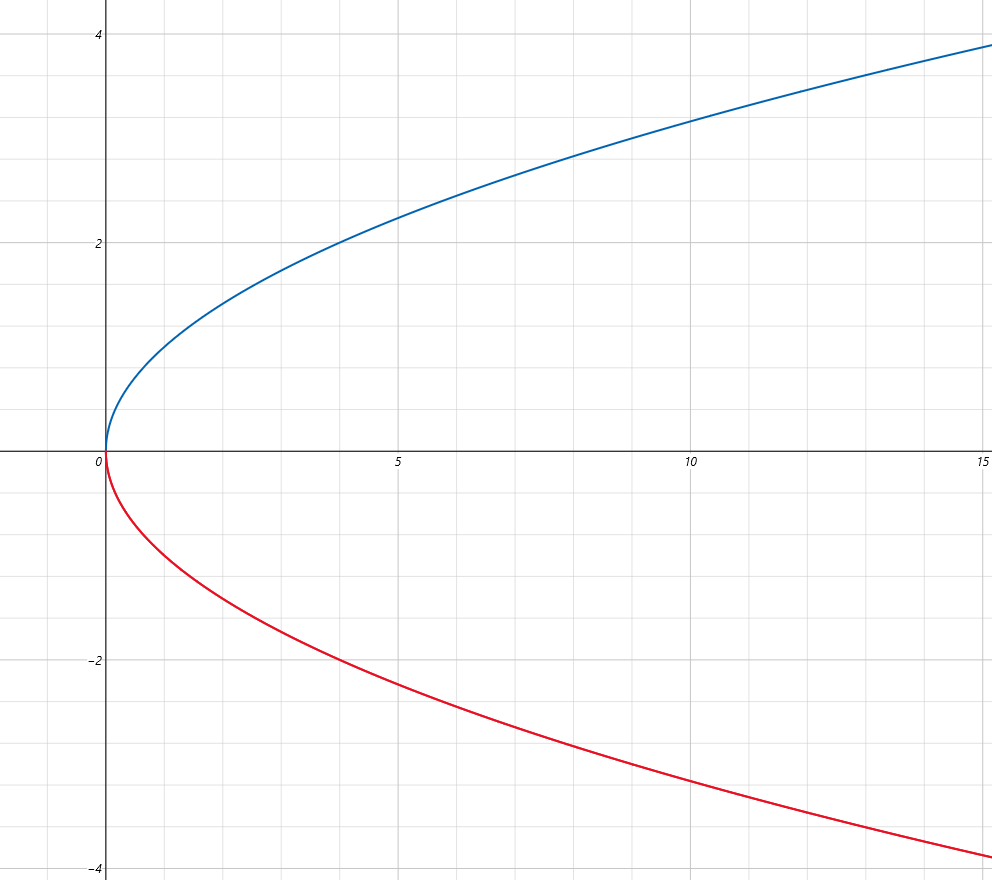
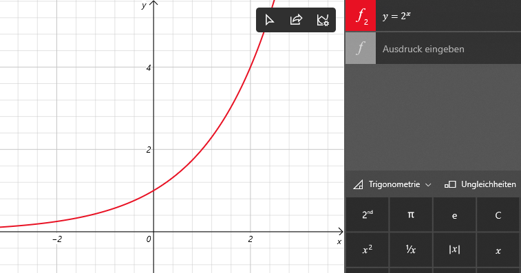
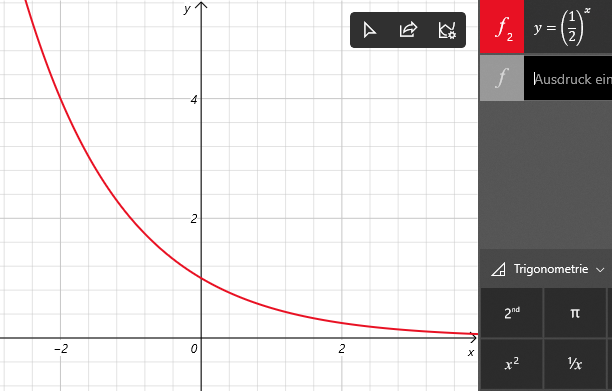

# Elementare Funktionen

## Potenzgesetze mit ganzzahligen Exponenten
Für $a,b \in \mathbb{R}$ und $n,m \in \mathbb{Z}$ gilt:

$$ a^n*a^m=a^{n+m} $$

$$ \frac{a^n}{a^m}=a^{n-m}  $$

$$ a^n*b^n=(a*b)^n $$

$$ \frac{a^n}{b^n}=( \frac{a}{b} )^n $$

$$ a^{-1} = \frac{1}{a^n} \implies 0^{-n} = \frac{1}{0^n} \implies \text{ undefiniert; ausser wenn } 0^{-0} \text{ Also hier muss } a \in \mathbb{R} \backslash \set{0} \text{ sein.} $$

$$ a^0 = 1 $$

$$ a^1 = a $$

$$ 0^0 = 1 $$

$$ 0^n = 0 \text{ für } n > 0 $$


## Potenzgesetze mit reellen Exponenten
Für $m \in \mathbb{Z}, n \in \mathbb{N} \backslash \set{0}$ und $a > 0$:

$$ a^{\frac{m}{n}} = \sqrt[n]{m} $$ 

Sei $a,b > 0$ und $n,m \in \mathbb{R}$ dann gilt:

$$ a^n*a^m=a^{n+m} $$

$$ \frac{a^n}{a^m}=a^{n-m}  $$

$$ a^n*b^n=(a*b)^n $$

$$ \frac{a^n}{b^n}=( \frac{a}{b} )^n $$

$$ a^{-1} = \frac{1}{a^n} \implies 0^{-n} = \frac{1}{0^n} \implies \text{ undefiniert; ausser wenn } 0^{-0} \text{ Also hier muss } a \in \mathbb{R} \backslash \set{0} \text{ sein.} $$

$$ a^0 = 1 $$

$$ a^1 = a $$

$$ 0^0 = 1 $$

$$ 0^n = 0 \text{ für } n > 0 $$

Potenzen leben in zwei Welten. Entweder mit ganzzahligen Exponenten, für welche negative Werte als Basis zugelassen sind, oder Potenzen mit reellen Exponenten. Für $a \geq 0$:

$$ (a^n)^{\frac{1}{2}} = a^{2*\frac{1}{2}} = a^1 = a $$

Für $a < 0$:

$$ (a^2)^{\frac{1}{2}} = \sqrt{a^2} = |a| $$


## Wurzelfunktion
```math
\sqrt[n]{} =
  \begin{cases}
     \mathbb{R}^+ \to  \mathbb{R}^+ \\
    a \mapsto \text{positive Lösung } x^n = a
  \end{cases}
```

Für $a \geq 0$, dann gilt: $\sqrt{a^2} = a$ oder $\sqrt{a}^2 = a$.
Für $a < 0$ und gerade Exponenten, dann gilt $\sqrt{a^2} = |a|$


## Potenzfunktion

### Ganzzahlig Positive Potenzfunktion
Für $n \geq 0$ und ganzzahlig:
```math
\cdot^n =
  \begin{cases}
     \mathbb{R} \to  \mathbb{R} \\
    x \mapsto x^n
  \end{cases}
```


### Ganzzahlig Negative Potenzfunktion
Für $n < 0$ und ganzzahlig:
```math
\cdot^n =
  \begin{cases}
     \mathbb{R} \backslash \set{0} \to  \mathbb{R} \backslash \set{0} \\
    x \mapsto  x^n
  \end{cases}
```
da $a^{-n} = \frac{1}{a^n}$ und $0^{-n} = \frac{1}{0^n}$ und dies ist nur für $n=0$ definiert da $0^n=1$


### Reelle Positive Potenzfunktion
Für $n \geq 0$ und $n \in \mathbb{R}$:
```math
\cdot^n =
  \begin{cases}
     \mathbb{R}^+ \to  \mathbb{R}^+ \\
    x \mapsto x^n
  \end{cases}
```


### Reelle Negative Potenzfunktion
Für $n < 0$ und $n \in \mathbb{R}$:
```math
\cdot^n =
  \begin{cases}
     \mathbb{R}^+ \backslash \set{0} \to  \mathbb{R}^+ \backslash \set{0} \\
    x \mapsto  x^n
  \end{cases}
```
Da zum Beispiel $(a^2)^{\frac{1}{2}} = a^{2*\frac{1}{2}} = a^1 = a$ für $a \geq 0$.
Jedoch für $a < 0$ ergibt diese Rechnung $\sqrt{a^2} = |a| = a \lor -a$.


Beispiel $x^{1/2}$ für $D=\mathbb{R}$ (Also keine Funktion, sondern eine Relation):


## Exponential Funktion (Reelle)
Für $a \geq 0$ definieren wir$:
```math
exp_a =
  \begin{cases}
     \mathbb{R} \to  \mathbb{R}^+ \backslash \set{0} \\
    x \mapsto  a^x
  \end{cases}
```

$$ exp_a(x+y) = exp_a(x) * exp_a(y) $$

$$ exp_a(x-y) = \frac{exp_a(x)}{exp_a(y)} $$

$$ exp_a(-x) = \frac{1}{exp_a(x)} $$

$$ (exp_a(x))^y = exp_a(x*y) $$

$$ exp_a(0) = 1 $$

$$ exp_a(a) = a $$

Für $a \geq 1$ ist die Funktion streng monoton steigend:


Für $0 < a < 1$ ist die Funktion streng monoton steigend:


## Logarithmus
