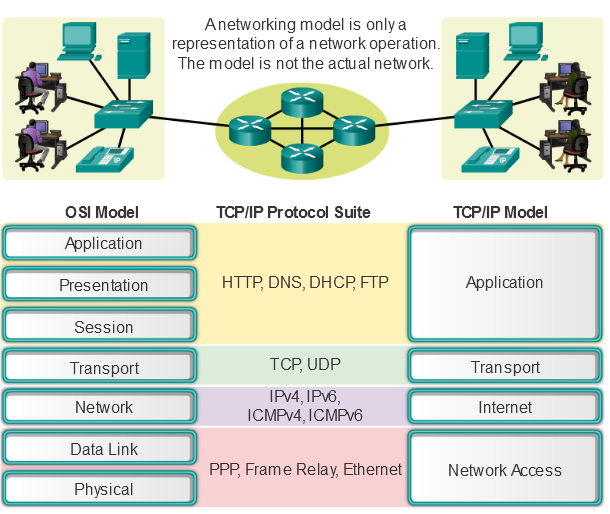
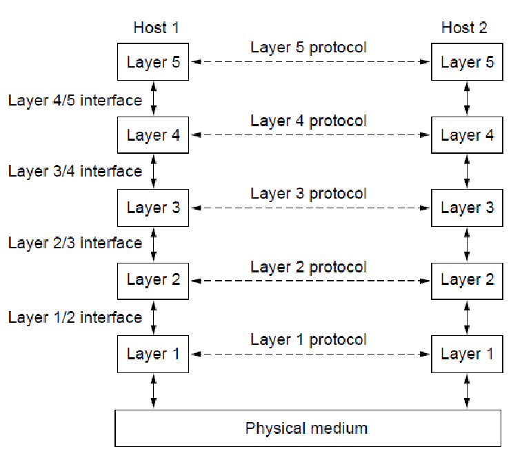

# Fundamentals

## General Terms

### Client - Server

TODO

### Peer to Peer (P2P)

TODO

### Network Types

- Lan
  - TODO
- MAN
  - TODO
- WAN
  - TODO 

### Intranet / Extranet

TODO

### Connection / Connectionless Services

#### Connectionless based services
- No signaling necessary
  - "Best Effort" service
  - simple implementation
  - frames are usually sent without acknowledgement
  - if necessary error correction is taken over by higher layers
- Suitable for
  - low error rate
  - Real-time data

#### Connection based services
- Connection establishment before frames are sent
- Implementation requires special frames for signaling
  - Connect / Disconnect
- Guaranteed services
  - Reception
  - Sequence
  - Quality
- Receipt confirmation and retransmission in case of data loss or corruption
  - Each Data Frame must be acknowledged by the receiver
    - Acknowledgement (ACK) Control Message
  - Data frames are stored until acknowledged by the sender
    - Buffer management necessary
  - if no acknowledgement is received within the specified time interval, the data is sent again.
  - Frames need sequence numbers
    - Sequence of frames
    - Detection of duplicates

### Message Delivery Options

## Layered Communication Model

In a layered model the complexity of data comunication of many interacting components (hardware, software, protocols)
is decompositioned into a number of functional layer where:
- similar functions should be in the same layer
- independent functions in different layers
- well-defined handover between layers
- each layer receives a service from the layer below

### Benefits

- Easy and better protocol design because protocols on specific layers have defined information to work with and defined
- Foster competition because of compatibility
- Prevent implementation changes on layers from affecting other layers
- Common language to describe networking functions and capabilities

## Quellen und Unterlagen
- [LAN Wiki](https://de.wikipedia.org/wiki/Local_Area_Network)
- [MAN Wiki](https://de.wikipedia.org/wiki/Metropolitan_Area_Network)
- [WAN Wiki](https://de.wikipedia.org/wiki/Wide_Area_Network)
- [Cisco Layered Models](http://cisco.num.edu.mn/CCNA_R&S1/course/module3/3.2.4.1/3.2.4.1.html)
