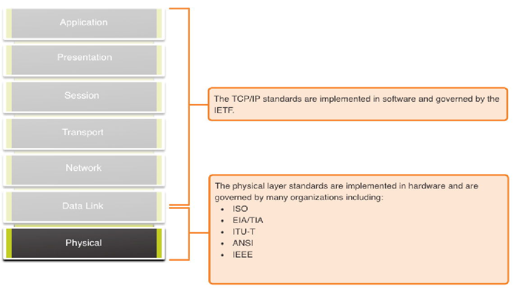
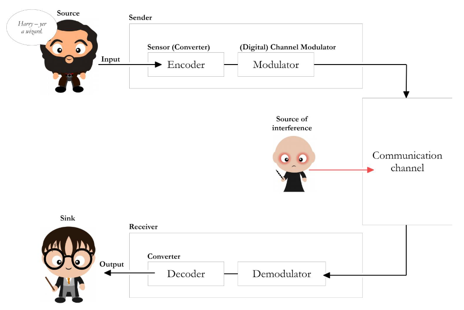
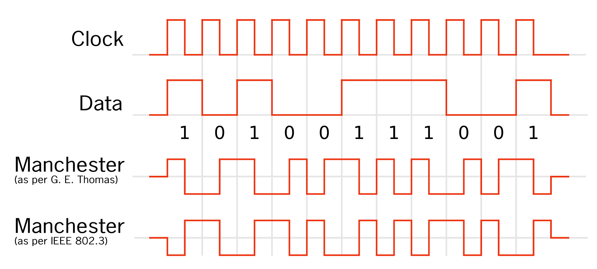

# Physical Layer
- Transports bits across media
- Accepts frame from Data Link Layer and encodes it as a series of signals
- Can be wired or wireless
- Network Interface Card (NIC) connects a device

## Standards

## Encoding
- Bits are encoded into a pattern of light, sound, or electrical impulses
- Must be in a appropriate format for the medium
- Destination must be able to decode signals to interpret the message
- Defined in standards
- Depending on the medium are specific encodings more suited

### Signaling
- Describes how the bit values are representet on the medium
- Method will vary based on the medium type

### Methods

#### Manchester

- Self clocking
- G. E. Thomas 1949
- 
TODO

## Layer 2 Interface

## Numbers

### Dec - Bin

#### Example Dec - Bin:

$$ 100 \text{ } Base10 $$

$$100 : 2 = 50 \text{ } Rest \text{ } 0$$

$$50  : 2 = 25 \text{ } Rest \text{ } 0$$

$$25  : 2 = 12 \text{ } Rest \text{ } 1$$

$$12 : 2 = 6 \text{ } Rest \text{ } 0$$

$$6  : 2 = 3 \text{ } Rest \text{ } 0$$

$$3 : 2 = 1 \text{ } Rest \text{ } 1$$

$$1 : 2 = 0 \text{ } Rest \text{ } 1$$

$$\implies 1100100 \text{ } Base2$$

#### Example Bin - Dec

$$ 1100100 \text{ } Base2$$

$$ 0 \* 2^0+...+1 \* 2^2+1 \* 2^5+1 \* 2^6 = 100 $$

### Dec - Hex
Same method see "Dec - Bin" above.

### Bin - Hex

#### Example: Bin - Hex
- Break the bin number (right to left) into groups of four digits (nibbles).
- Convert groups to dec
- Convert dec to hex
- Put hex digits together

$$ 1100100 \text{ } Base2$$

$$0100 = 4 \text{ } base10 = 0\text{x}4$$

$$ 110 = 6 \text{ } base10  = 0\text{x}6$$

$$ \implies 0\text{x}64$$

#### Example: Hex - Bin
Reverse the method explained above.

### Representation

### Bandwith (Base10)
Unit | Abbreviation | Equivalence
-----|--------------|------------
Bits per second | bps | $1$ bps
Kilobits per second | Kbps | $10^3$ bps
Megabits per second | Mbps | $10^6$ bps
Gigabits per second | Gbps | $10^9$ bps
Terabits per second | Tbps | $10^{12}$ bps

### Binary prefixes
Unit | Abbreviation | Equivalence
-----|--------------|------------
bit | Ki | $2^0$ bps
kibi | Mi | $2^{10}$ oder 1024 bits
mebi | Gi | $2^{20}$ oder 1024 kibi bits
gibi | Ti | $2^{30}$ oder 1024 mebi bits
tebi | Pi | $2^{40}$ oder 1024 gibi bits
